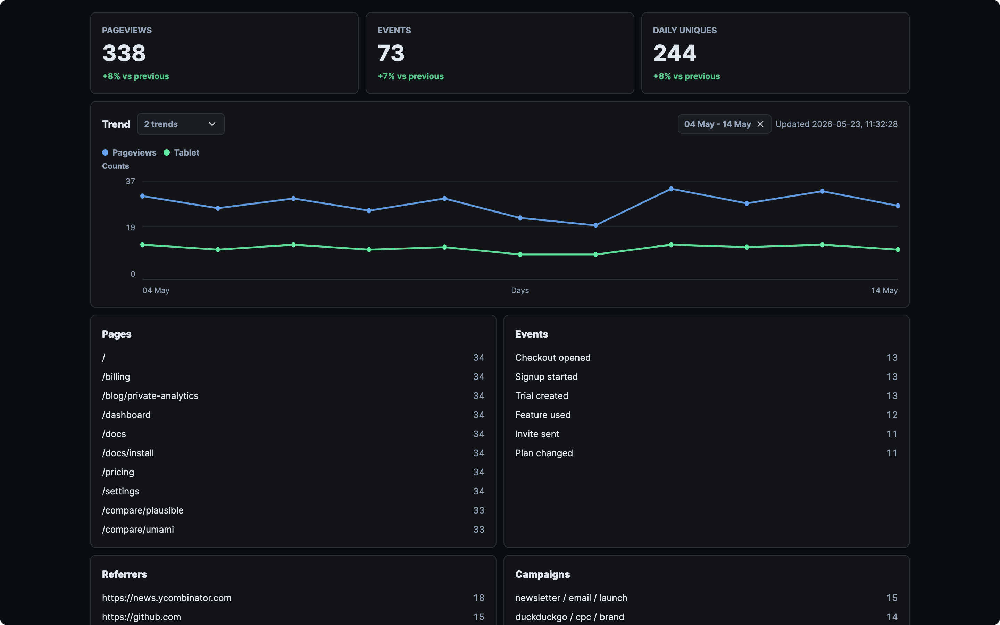

# MikroAnalytics

**Private, self-hosted analytics for teams that want product signal without visitor profiling.**



MikroAnalytics is the MikroSuite approach to web and product analytics: minimal, clean, self-hostable, and designed around aggregate usage patterns instead of individual visitor tracking.

Use it when you want the useful parts of Umami, Fathom, Plausible, or a narrow Google Analytics setup, but with a smaller surface, clearer privacy posture, SQLite storage, MikroAuth sign-in, and a tracker you can understand.

## Why MikroAnalytics

- **Know what matters without over-collecting**: pageviews, SPA navigation, referrers, campaigns, devices, browsers, OS, optional country, and custom product events.
- **Private by default**: no cookies, no local storage, no cross-site IDs, no raw IP storage, no raw user-agent storage, no fingerprinting, and no visitor timelines.
- **Own the data**: run it on your infrastructure and keep analytics in a plain SQLite database.
- **Tiny integration surface**: add one script and call `window.mikro.event(name, properties)` when product moments matter.
- **MikroSuite fit**: quiet UI, production esbuild bundling, MikroAuth magic links, explicit config, and a compact API.
- **Fast to trust**: manage sites in a dedicated view, copy the snippet, and use the install check to see whether requests are accepted or ignored.
- **GDPR-conscious design**: data minimisation, clear retention, self-hosting, DNT/GPC support, and no third-party analytics processor unless your hosting setup adds one.

MikroAnalytics does not make legal decisions for you. Your compliance still depends on your notices, legal basis, hosting, processor agreements, retention policy, and local ePrivacy interpretation.

## Features

- Tiny tracker served from `/m.js`
- Automatic pageviews and History API navigation tracking
- Custom events through `window.mikro.event(name, properties)`
- Markup events through `data-mikro-event`
- Aggregate-first SQLite storage
- Strict privacy defaults with raw events disabled
- Optional daily unique estimates through site-scoped, rotating hashes
- Referrer origin and campaign reporting without storing full URLs
- DNT and Global Privacy Control support by default
- MikroAuth magic-link dashboard sign-in
- Protected reporting API with session-cookie or bearer-token access
- Dedicated Stats and Sites views, install check, and period-over-period metric comparisons
- OpenAPI document at `/openapi.json`
- Retention cleanup for aggregates and optional raw debug records
- Astro Starlight docs in `docs/`

## Quick Start

```bash
mkdir -p mikroanalytics/api mikroanalytics/app
ROOT="$PWD/mikroanalytics"

curl -sSL -o "$ROOT/mikroanalytics_api.zip" https://releases.mikrosuite.com/mikroanalytics_api_latest.zip
curl -sSL -o "$ROOT/mikroanalytics_app.zip" https://releases.mikrosuite.com/mikroanalytics_app_latest.zip

unzip -q "$ROOT/mikroanalytics_api.zip" -d "$ROOT/api"
unzip -q "$ROOT/mikroanalytics_app.zip" -d "$ROOT/app"

API_DIR="$(find "$ROOT/api" -mindepth 1 -maxdepth 1 -type d | head -n 1)"
APP_DIR="$(find "$ROOT/app" -mindepth 1 -maxdepth 1 -type d | head -n 1)"

cd "$API_DIR"
cp mikroanalytics.config.json.example mikroanalytics.config.json
MIKROANALYTICS_STATIC_ROOT="$APP_DIR" node server.mjs
```

Open `http://127.0.0.1:3000`.

Auth is disabled by default in the example config, so the dashboard opens as a local admin and no magic-link emails are sent. For production, enable MikroAuth, configure allowed emails or domains, set a strong JWT secret, and configure SMTP.

The dashboard reads `/config.json` at startup for public runtime settings such as auth mode and auth route paths. Secrets remain in server config, environment variables, and SQLite.

Create a site in the dashboard, add its allowed origins, then add the generated tracker snippet to the site you want to measure:

```html
<script defer src="https://analytics.example.com/m.js" data-site="site_marketing"></script>
```

The dashboard shows recent collect attempts so you can tell whether the tracker is receiving data, blocked by an origin rule, ignored by a privacy signal, or using the wrong site ID.

Track custom events:

```js
window.mikro.event("signup", { plan: "team" });
```

Or with markup:

```html
<button data-mikro-event="signup_click" data-mikro-prop-plan="team">Start</button>
```

## Configuration

MikroAnalytics uses MikroConf. The primary configuration file is `mikroanalytics.config.json`; environment variables and CLI flags are intended for deployment-specific overrides such as secrets, host, and port. Sites and analytics origins are managed in the dashboard.

Common settings:

- `MIKROANALYTICS_ADMIN_TOKEN` - bearer token for dashboard and reporting API automation
- `MIKROANALYTICS_APP_URL` - public dashboard URL used in magic links
- `MIKROANALYTICS_AUTH_ENABLED` - enables MikroAuth magic-link sign-in
- `MIKROANALYTICS_AUTH_ALLOWED_EMAILS` - comma-separated allowed sign-in emails
- `MIKROANALYTICS_AUTH_ALLOWED_DOMAINS` - comma-separated allowed sign-in domains
- `MIKROANALYTICS_AUTH_JWT_SECRET` - at least 32 characters when auth is enabled
- `MIKROANALYTICS_EMAIL_HOST`, `MIKROANALYTICS_EMAIL_USER`, `MIKROANALYTICS_EMAIL_PASSWORD` - SMTP delivery
- `MIKROANALYTICS_CONFIG_PATH` - config file path
- `MIKROANALYTICS_AGGREGATE_RETENTION_DAYS` - aggregate retention
- `MIKROANALYTICS_COLLECT_UNIQUE_VISITORS` - enable daily unique estimates
- `MIKROANALYTICS_UNIQUE_SALT` - required when unique estimates are enabled
- `MIKROANALYTICS_STORE_RAW_EVENTS` - enable short-lived raw debug records
- `MIKROANALYTICS_TRUST_PROXY` - read forwarded IP headers for unique estimates

Common CLI overrides:

- `--config` or `--config-path` - config file path
- `--host`, `--port` - server binding
- `--admin-token` - bearer token for API automation
- `--app-url` - public dashboard URL

## Privacy Model

MikroAnalytics is designed around data minimisation:

- no cookies
- no local storage
- no cross-site identifiers
- no full referrer URLs
- no full page URLs with query strings
- no raw IP storage
- no raw user-agent storage
- no visitor profiles or timelines
- raw debug events off by default
- aggregate retention defaults to 395 days

Daily unique estimates are disabled by default. When enabled, MikroAnalytics hashes IP address and user-agent with a site ID, UTC date, and secret salt, then stores only the daily hash. This is useful but still more privacy-sensitive than strict aggregate counting.

## API

- `GET /` serves the dashboard
- `GET /m.js` serves the browser tracker
- `GET /config.json` returns public browser runtime config
- `GET /health` returns service health
- `GET /openapi.json` returns the OpenAPI document
- `GET /api/auth/me` returns dashboard auth state
- `POST /api/auth/magic-link` sends a MikroAuth magic link
- `POST /api/auth/verify` verifies a magic link and sets an HttpOnly session cookie
- `POST /api/auth/logout` clears the session cookie
- `POST /api/collect` ingests pageviews and events
- `GET /api/sites` lists dashboard-managed sites and requires a dashboard session or admin bearer token
- `POST /api/sites` creates a dashboard-managed site and requires a dashboard session or admin bearer token
- `PUT /api/sites/:id` updates a dashboard-managed site and requires a dashboard session or admin bearer token
- `DELETE /api/sites/:id` deletes a dashboard-managed site and its stored analytics data and requires a dashboard session or admin bearer token
- `GET /api/report?site=site_marketing&days=30` returns aggregates and requires a dashboard session or admin bearer token
- `GET /api/collect-attempts?site=site_marketing` returns recent in-memory install-check requests and requires a dashboard session or admin bearer token
- `POST /api/cleanup` deletes expired records and requires a dashboard session or admin bearer token

## Release Downloads

Latest release downloads:

- `https://releases.mikrosuite.com/mikroanalytics_api_latest.zip` - Node API service
- `https://releases.mikrosuite.com/mikroanalytics_app_latest.zip` - static dashboard and tracker assets

GitHub Releases provide versioned archives for pinned deployments.

## Technology

- **Runtime**: Node.js
- **Auth**: MikroAuth magic links with HttpOnly session cookies
- **Configuration**: MikroConf with JSON config and deployment overrides
- **Storage**: SQLite through `node:sqlite`
- **Frontend**: Vanilla HTML, CSS, and TypeScript
- **Build**: Prebuilt release archives, with esbuild-based production bundles

## License

MIT.
